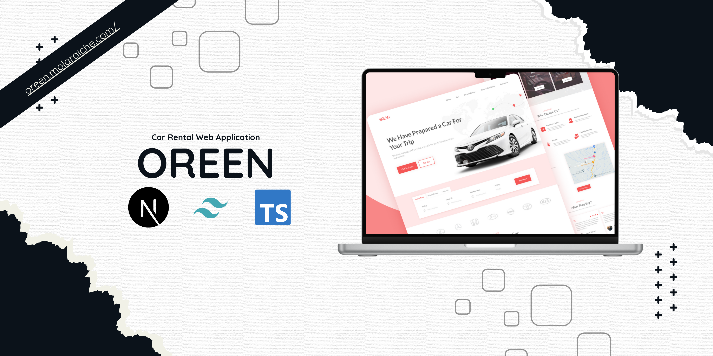

# OREEN

A Modern Rental Car Web Application, make booking cars and running car rental agency easy.

## Main Features

- Admin Dashboard to manage the cars,comments, and booking requests
- book send functionality
- Comprehensive SEO optimization.
- A high score in the Google Lighthouse tool: 91-100.

## Technologies Used

- Next.js
- React.js
- Tailwind CSS
- TypeScript
- JavaScript
- Express.js
- MongoDB

## 🚀 Running the Development Server

```bash

# clone the project
git clone https://github.com/molaraiche/oreen-client.git

# Install dependencies
cd client
cd ..
npm install
cd ..
cd server
npm install


# Start the development server
cd server
npm run dev
cd client
npm run dev
```

## Developer Contact

[molaraiche](http://molaraiche.com/)
