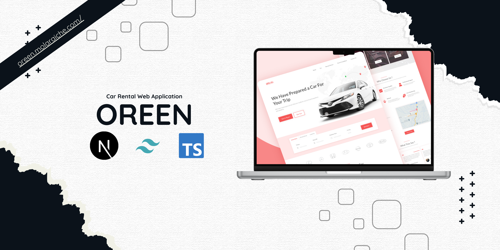

# OREEN

A Modern Rental Car Web Application, make booking cars and running car rent agency easy.

## Main Features(on going)

## Technologies Used(on going)

## 🚀 Running the Development Server

```bash

# clone the project
git clone https://github.com/molaraiche/oreen.git

# go to the folder
cd oreen

# Install dependencies
npm install

# Start the development server
npm run dev
```

## Developer Contact

[molaraiche](http://molaraiche.com/)
